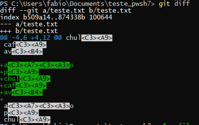
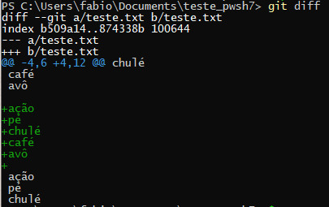

# git-diff-powershell-fix

## O problema
Quando executamos git diff no powershell alguns caracteres não aparecem corretamente, como nessa imagem:

## A solução
No powershell, digitar esses comandos:

1. Verifique se você já tem um arquivo de perfil criado
`Test-Path $PROFILE`
2. Se não existir esse arquivo, crie com esse comando:
`New-Item –Path $PROFILE –Type File –Force`
3. Abra esse arquivo com o notepad
`notepad $PROFILE`
4. Insira esse comando nesse arquivo:
`$Env:LESSCHARSET="utf8"`
5. Salve e feche esse arquivo e digite isso no powershell:
`.$PROFILE`

Pronto!

